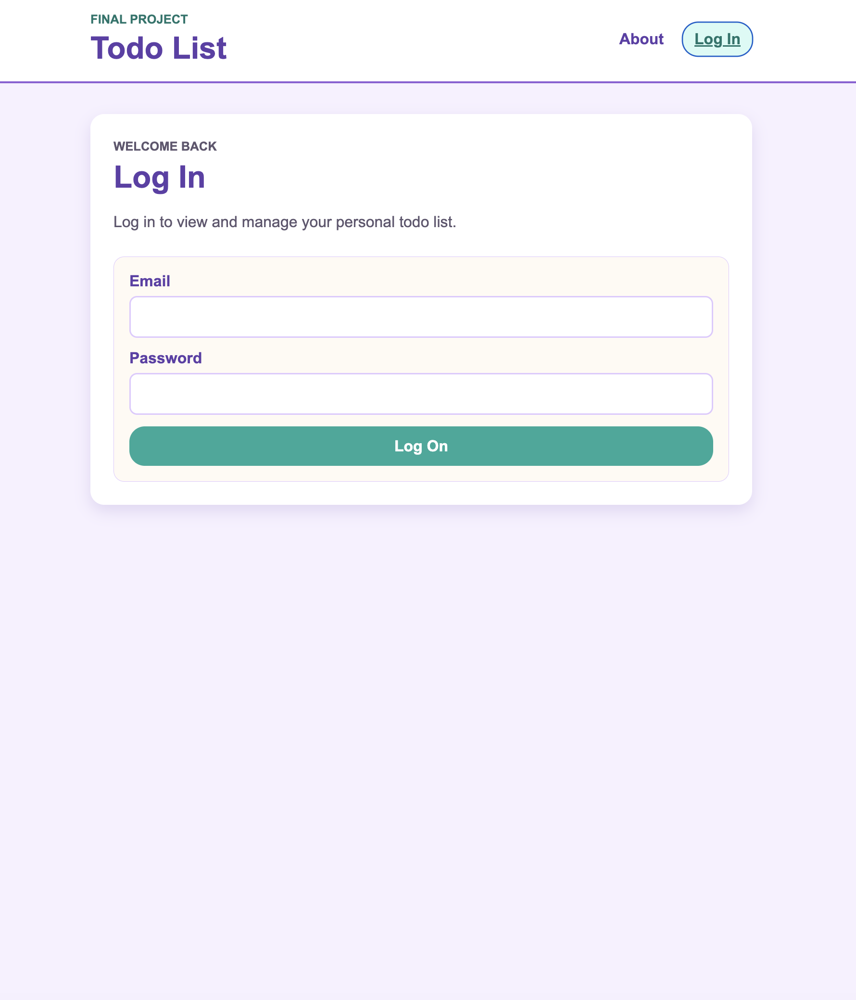
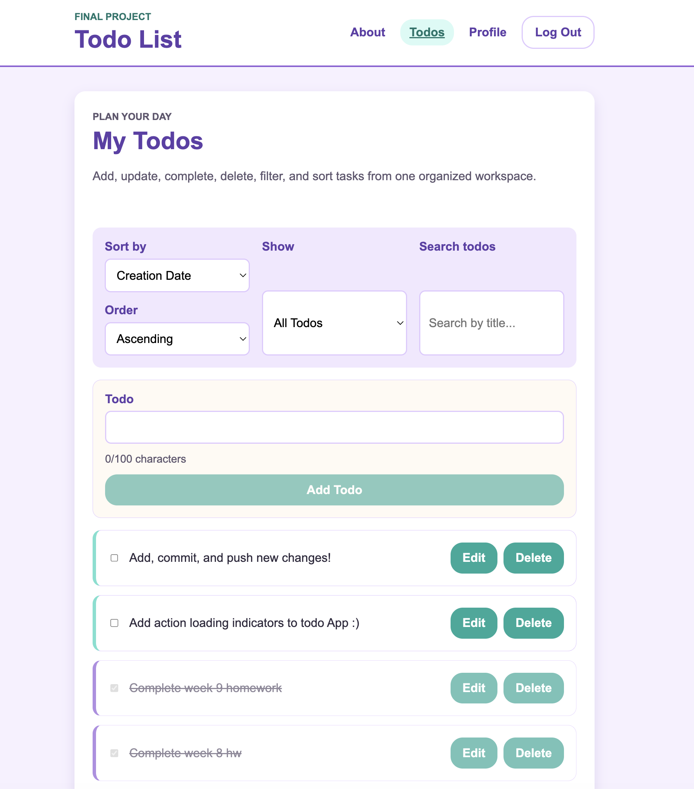
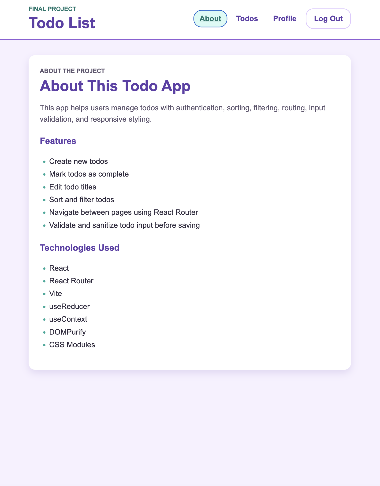
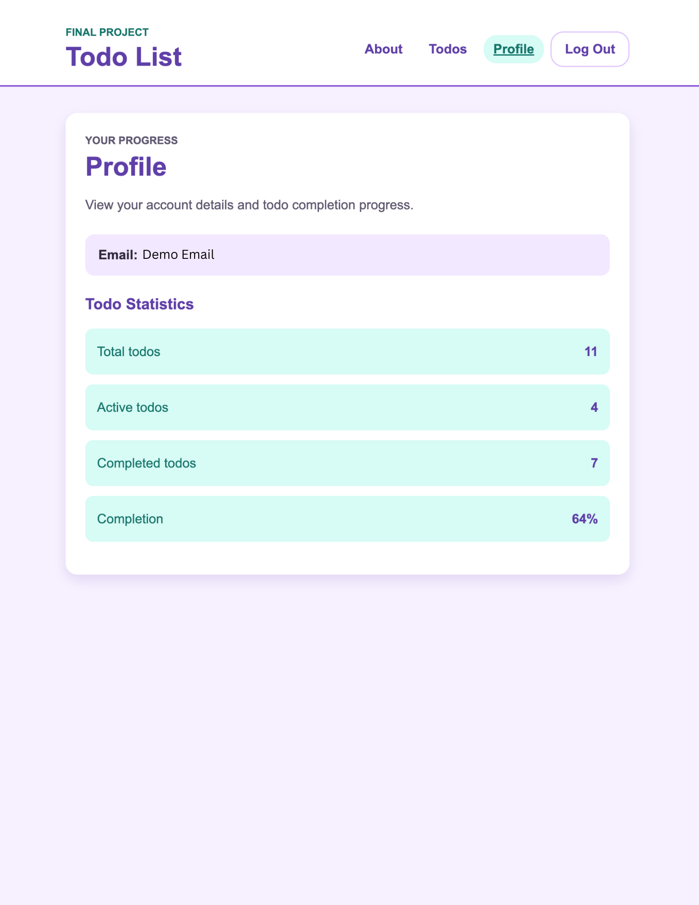
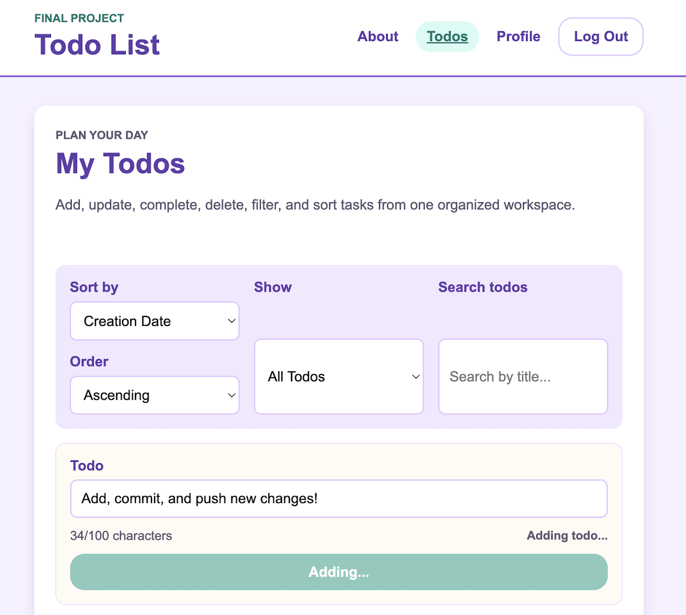

To Do List App

A React App for managing tasks with authentication, routing, filtering, sorting, editing, completion tracking, 
and input validation. This final project brings together React fundamentals, state management, API interaction, 
protected routes, security best practices, and responsive styling.

## 🚀 Live Demo
Deployment on Netlify at this link: shontas-react-todoapp.netlify.app

## 🎥 Demo Video
live demo: https://youtu.be/ielwZCwrJg8_

## 📸 Screenshots

## 💻 Technologies Used
- **Frontend:** React, React Router, CSS
- **State Management:** useReducer, Context API/useContext 
- **Build Tool:** Vite
- **API/Data:** Fetch API with authenticated requests
- **Security/Input Validation:** DOMPurify, reusable todo validation helpers
- **Development Tools:** Git, GitHub, npm
- **Deployment:** Netlify

## 💡 Features
- User login and logout flow
- Protected routes for authenticated pages
- Create new todos
- Edit existing todo titles
- Mark todos as complete
- Sort todos by creation date or title
- Filter todos by active, completed, or all
- Search todos by title
- View profile statistics:
    - Total todos
    - Active todos
    - Completed todo
    - Completion percentage

- Responsive lavender and teal visual design
- User-friendly loading, error, and empty states
- Input validation to prevent blank or overly long todo titles
- Todo title sanitization using DOMPurify

## 🔐 Security & Validation
This project includes several secutiry and validation improvements
- Todo titles are validated before being submitted.
- Updated to avoid Blank todo titles
- Todo titles are limited to 100 characters.
- Todo input is normalized by trimming extra spaces
- DOMPurify sanitizes todo titles before they are saved.
- Script-only input is rejected after sanitization.
- HTML tags are cleaned from todo text before saving.
- Authenticated API requests include the CSRF token provided by the login flow.
- Protexted pages are wrapped in a route guard so unauthenticated users are redirected to login.

## 🎨 UX & Styling Additions
For the final project polish, I updated the app with:
- Lavender and teal color palette
- Styled navigation with active link states
- Rounded buttons and form inputs
- Styled todo cards
- A visible Edit button for clearer user interaction
- Completed todo styling with faded and crossed-out text
- Responsive layout for smaller screens
- Styled profile, about, login, home, and not found pages
- Clear loading, empty, warning, and error messages

## 🖥️ Installation Instructions & Environment Setup:
1. Clone the repository using: 
    - git clone <your-repo-url>
2. Navigate into the project folder: 
    - cd <project-folder>
3. Install your dependencies using: 
    - npm install
4. Create your environment file:
    - Copy .env.example and rename the copy to .env
5. Confirm your .env file contains:
    - VITE_TARGET=https://ctd-learns-node-l42tx.ondigitalocean.app
6. Start the development server:
    - npm run dev
7. Open the app in your browser:
    - http://localhost:51732

## 🌟 How to run the Development Server:
1. Run your development server (I used Vite), using: npm run dev
2. Open your browser and run it at: http://localhost:5173 to see it live.

## 📜 Available Scripts
- Run the development server: npm run dev
- Build the app for production: npm run build
- Preview the production build locally: npm run preview

## 🔮 Future Improvements

Possible future improvements include:

- Add a delete todo feature
- Add due dates or priority labels
- Improve automatic logout handling after an unauthorized API response
- Add toast notifications for successful actions

## 👤 Contact
Created by Shonta P.
- GitHub: https://github.com/shontechdev 
- Portfolio: https://shontechdev.github.io/ 

## 🪪 License
This project is licensed under the MIT License.